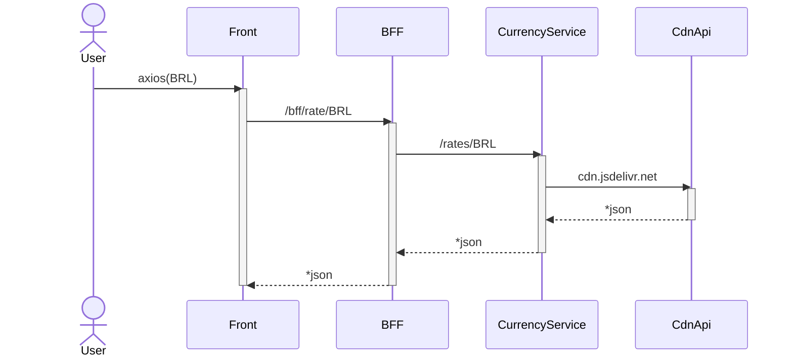

### currency-rate-app



### Requirements

* java 11
* mvn 3+
* docker
* docker-compose
* curl (optional)

### Run

    make build run

### Get

* Currencies
```
curl http://localhost:8007/bff/currency
```
* Rate
```
curl http://localhost:8007/bff/rate/BRL
```

### Doc

* [Service](./currency-service/README.md)
* [BFF](./currency-bff/README.md)
* [Front](./currency-front/README.md)